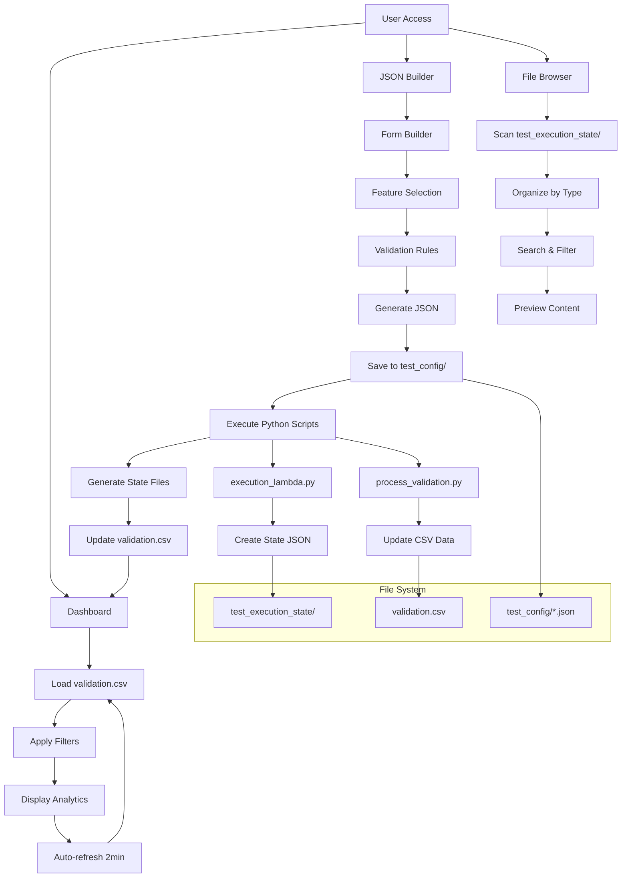

# Duke Energy Data Products Testing - Configuration Guide

## Table of Contents
1. [Application Configuration](#application-configuration)
2. [Component Architecture](#component-architecture)
3. [Button Workflows](#button-workflows)
4. [Database Management](#database-management)
5. [File Operations](#file-operations)
6. [Python Script Integration](#python-script-integration)
7. [API Endpoints](#api-endpoints)
8. [Frontend Configuration](#frontend-configuration)
9. [Theme Customization](#theme-customization)
10. [Performance Tuning](#performance-tuning)

---

## Application Configuration

### Environment Setup
The application uses environment variables for configuration. Key settings include:

```bash
NODE_ENV=development
PORT=5000
```

### Project Structure
```
├── client/                 # React frontend application
│   ├── src/
│   │   ├── components/     # Reusable UI components
│   │   ├── pages/          # Main application pages
│   │   ├── hooks/          # Custom React hooks
│   │   └── lib/            # Utility libraries
├── server/                 # Express.js backend
├── shared/                 # Shared TypeScript schemas
├── src/common/utils/       # Python utilities
├── test_config/            # Test configuration files
└── test_execution_state/   # Generated test state files
```

### Core Dependencies
- **Frontend**: React 18, TypeScript, Vite, TailwindCSS, Radix UI
- **Backend**: Express.js, TypeScript
- **State Management**: TanStack Query for server state
- **Validation**: Zod schemas for type safety
- **Charts**: Recharts for data visualization

---

## Component Architecture

### Core Components Overview

#### 1. Dashboard (`client/src/pages/dashboard.tsx`)
- **Purpose**: Real-time monitoring and analytics for test execution
- **Features**:
  - Auto-refresh every 30 seconds
  - Comprehensive filtering (domain, stage, status, date range)
  - Interactive charts and statistics
  - Paginated test execution history (10 items per page)
- **Key Props**: None (self-contained)
- **State Management**: Uses TanStack Query for data fetching

#### 2. JSON Builder (`client/src/pages/json-builder.tsx`)
- **Purpose**: Dynamic form builder for test case configuration
- **Features**:
  - Real-time JSON preview with syntax highlighting
  - CodeMirror editor integration
  - Template loading and saving
  - Lambda execution and state JSON viewing
- **Dependencies**: `use-json-form` hook, `form-builder` component

#### 3. Form Builder (`client/src/components/form-builder.tsx`)
- **Purpose**: Dynamic form generation based on schema
- **Features**:
  - Support for multiple test case types (land/gas/electric)
  - Dependent test case selection with autocomplete
  - Action-based form fields (CREATE/UPDATE/DELETE)
- **Props**: Form data, handlers, validation errors

#### 4. File Browser (`client/src/components/file-browser.tsx`)
- **Purpose**: Browse and preview test execution state files
- **Features**:
  - Directory tree navigation
  - File content preview
  - Auto-refresh functionality
- **File Types Supported**: `.json`, `.state.json`

### Component Communication Pattern
```
Dashboard ←→ API ←→ Server ←→ Python Scripts
     ↓
JSON Builder ←→ Form Builder ←→ File Browser
```

---

## Button Workflows

### Primary Actions

#### 1. Generate JSON Button
- **Location**: JSON Builder page
- **Function**: Converts form data to JSON configuration
- **Validation**: Zod schema validation before generation
- **Output**: Formatted JSON in the editor panel

#### 2. Save Configuration Button
- **Location**: JSON Builder page
- **Function**: Saves JSON configuration to `test_config/` directory
- **API Endpoint**: `POST /api/save`
- **Response**: Success confirmation with file path

#### 3. Execute Lambda Button
- **Location**: JSON Builder page
- **Function**: Executes Python validation script with test configuration
- **Process**: 
  1. Saves current configuration
  2. Calls `src/common/utils/execution_lambda.py`
  3. Returns execution status
- **API Endpoint**: `POST /api/execute-lambda`

#### 4. State JSON Button
- **Location**: JSON Builder page (appears after execution)
- **Function**: Retrieves and displays execution state
- **File Source**: `test_execution_state/{action}_validation/{testCaseId}.state.json`
- **Display**: CodeMirror editor with JSON syntax highlighting

#### 5. Validate Features Button
- **Location**: JSON Builder page
- **Function**: Triggers comprehensive validation process
- **Duration**: 1-minute delay for processing
- **Script**: `src/common/utils/validation/process_validation.py`

### Secondary Actions

#### 6. Refresh Button (Dashboard)
- **Function**: Manual data refresh
- **Auto-refresh**: Disabled during manual refresh
- **Re-enables**: Auto-refresh after completion

#### 7. Clear Filters Button (Dashboard)
- **Function**: Resets all filter selections to default
- **Affects**: Domain, stage, status, and date filters

#### 8. Load Template Button
- **Location**: JSON Builder page
- **Function**: Loads existing test configuration
- **Source**: Files from `test_config/` directory

---

## Database Management

### Data Storage Strategy
The application uses a hybrid storage approach:

#### 1. File-Based Storage
- **Test Configurations**: Stored as JSON files in `test_config/`
- **Execution States**: Generated in `test_execution_state/`
- **Validation Results**: CSV format in `validation.csv`

#### 2. In-Memory Processing
- **Dashboard Analytics**: Real-time computation from CSV data
- **Form State**: Managed via React hooks and local storage

#### 3. Data Flow



### Data Flow Architecture

```
┌─────────────────────────────────────────────────────────────────────┐
│                         USER INTERFACE LAYER                       │
├─────────────────┬─────────────────┬─────────────────────────────────┤
│   Dashboard     │  JSON Builder   │      File Browser              │
│   Analytics &   │  Form Creation  │      State File Management     │
│   Monitoring    │  & Validation   │      Search & Preview          │
└─────────────────┴─────────────────┴─────────────────────────────────┘
         │                   │                         │
         ▼                   ▼                         ▼
┌─────────────────────────────────────────────────────────────────────┐
│                         API GATEWAY LAYER                          │
├─────────────────────────────────────────────────────────────────────┤
│  • GET /api/validation-csv    • POST /api/save                     │
│  • GET /api/dashboard-stats   • POST /api/execute-lambda           │
│  • GET /api/execution-files   • POST /api/validate-features        │
│  • GET /api/load-template     • GET /api/state-json/:id/:action    │
└─────────────────────────────────────────────────────────────────────┘
         │                   │                         │
         ▼                   ▼                         ▼
┌─────────────────────────────────────────────────────────────────────┐
│                      BUSINESS LOGIC LAYER                          │
├─────────────────┬─────────────────┬─────────────────────────────────┤
│   Data Fetch    │  File Operations│     Python Execution           │
│   & Processing  │  & Validation   │     & State Management          │
└─────────────────┴─────────────────┴─────────────────────────────────┘
         │                   │                         │
         ▼                   ▼                         ▼
┌─────────────────────────────────────────────────────────────────────┐
│                      DATA PERSISTENCE LAYER                        │
├─────────────────┬─────────────────┬─────────────────────────────────┤
│ validation.csv  │  test_config/   │   test_execution_state/         │
│ Historical Data │  JSON Configs   │   Runtime State Files           │
│ Analytics Source│  User Created   │   Generated by Python           │
└─────────────────┴─────────────────┴─────────────────────────────────┘
```

### Detailed Component Interaction

```
Form Input → JSON Config → File Storage → Python Processing → State Files → Dashboard Display
```

**Execution Flow:**
1. **Form Input**: User creates test case configuration
2. **JSON Config**: Data validated and formatted as JSON
3. **File Storage**: Configuration saved to `test_config/`
4. **Python Processing**: Scripts execute validation logic
5. **State Files**: Results saved to `test_execution_state/`
6. **Dashboard Display**: Analytics updated with new results

### Data Persistence
- **Configuration Files**: Persistent across sessions
- **Execution States**: Generated per test run
- **User Preferences**: Browser local storage
- **Filter States**: Session-based (reset on refresh)

---

## File Operations

### Supported File Types

#### 1. JSON Configuration Files (`.json`)
- **Location**: `test_config/`
- **Purpose**: Test case definitions
- **Schema**: Validated against Zod schemas
- **Operations**: Create, Read, Update via API

#### 2. State Files (`.state.json`)
- **Location**: `test_execution_state/{action}_validation/`
- **Purpose**: Execution results and state tracking
- **Generated By**: Python validation scripts
- **Operations**: Read-only via API

#### 3. CSV Data Files (`.csv`)
- **Location**: Root directory (`validation.csv`)
- **Purpose**: Historical validation results
- **Format**: Structured columns for dashboard analytics
- **Operations**: Read via API, written by Python scripts

### File Management API

#### Directory Structure Reading
```typescript
GET /api/execution-files
// Returns: Hierarchical file structure
```

#### File Content Retrieval
```typescript
GET /api/execution-files/content?path={filePath}
// Returns: File content with metadata
```

#### Security Measures
- Path validation to prevent directory traversal
- Access limited to project directory
- File type validation for previews

---

## Python Script Integration

### Core Scripts

#### 1. Execution Lambda (`src/common/utils/execution_lambda.py`)
- **Purpose**: Individual test case execution
- **Input**: JSON configuration file
- **Output**: State JSON file
- **Integration**: Called via Node.js child process

#### 2. Validation Processor (`src/common/utils/validation/process_validation.py`)
- **Purpose**: Comprehensive test suite validation
- **Features**:
  - Bulk test processing
  - Statistics generation
  - CSV output for dashboard
- **Execution Time**: ~1 minute for full validation

### Python-Node.js Communication

#### Execution Pattern
```javascript
const executeScript = (scriptPath, args = []) => {
  return new Promise((resolve, reject) => {
    const python = spawn('python3', [scriptPath, ...args]);
    // Handle stdout, stderr, and exit codes
  });
};
```

#### Error Handling
- **Script Errors**: Captured via stderr
- **Exit Codes**: Non-zero codes trigger error responses
- **Timeouts**: Configurable timeout for long-running processes

#### Data Exchange
- **Input**: JSON configuration files
- **Output**: JSON state files and CSV reports
- **Logging**: Structured console output for debugging

---

## API Endpoints

### Test Configuration Management

#### Save Configuration
```typescript
POST /api/save
Body: { filename: string, content: object }
Response: { success: boolean, filename: string, path: string }
```

#### Load Templates
```typescript
GET /api/templates
Response: { success: boolean, templates: string[] }
```

### Execution Control

#### Execute Lambda
```typescript
POST /api/execute-lambda
Body: { testCaseId: string, action: string }
Response: { success: boolean, message: string }
```

#### Validate Features
```typescript
POST /api/validate-features
Response: { success: boolean, message: string }
```

### Data Retrieval

#### State JSON
```typescript
GET /api/state-json/:testCaseId/:action
Response: { success: boolean, data: object, filename: string }
```

#### Validation CSV
```typescript
GET /api/validation-csv
Response: ValidationRecord[]
```

### File Operations

#### Execution Files Structure
```typescript
GET /api/execution-files
Response: { success: boolean, files: FileNode[] }
```

#### File Content
```typescript
GET /api/execution-files/content?path={string}
Response: { success: boolean, content: string }
```

---

## Frontend Configuration

### State Management Architecture

#### 1. TanStack Query Configuration
```typescript
// client/src/lib/queryClient.ts
const queryClient = new QueryClient({
  defaultOptions: {
    queries: {
      staleTime: 30000,        // 30 seconds
      refetchInterval: 30000,  // Auto-refresh
      retry: 3,
      retryDelay: attemptIndex => Math.min(1000 * 2 ** attemptIndex, 30000)
    }
  }
});
```

#### 2. Form State Management
```typescript
// client/src/hooks/use-json-form.ts
const useJsonForm = () => {
  const [testCases, setTestCases] = useState<TestCase[]>([]);
  const [errors, setErrors] = useState<ValidationError[]>([]);
  // Form handlers and validation logic
};
```

### Routing Configuration
```typescript
// Single Page Application with conditional rendering
const App = () => {
  const [currentPage, setCurrentPage] = useState<'builder' | 'dashboard'>('builder');
  // Page routing logic
};
```

### Theme System
```typescript
// client/src/components/theme-provider.tsx
type Theme = "dark" | "light" | "system"
// Theme context and switching logic
```

---

## Theme Customization

### Color Palette System

#### Primary Colors
```css
/* Tailwind CSS Custom Colors */
:root {
  --color-gas: #FF6B35;      /* Orange for Gas domain */
  --color-electric: #4ECDC4;  /* Teal for Electric domain */
  --color-land: #45B7D1;     /* Blue for Land domain */
  --color-passed: #10B981;   /* Green for passed tests */
  --color-failed: #EF4444;   /* Red for failed tests */
}
```

#### Stage-based Colors
```css
:root {
  --color-create: #10B981;   /* Green for CREATE operations */
  --color-update: #F59E0B;   /* Yellow for UPDATE operations */
  --color-delete: #EF4444;   /* Red for DELETE operations */
}
```

### Component Theming

#### Dashboard Cards
- **Gradient Backgrounds**: Domain-specific color gradients
- **Status Indicators**: Color-coded badges for test status
- **Chart Colors**: Consistent with domain and status colors

#### Form Elements
- **Input Focus**: Blue accent colors
- **Validation States**: Red for errors, green for success
- **Button Variants**: Primary, secondary, destructive, outline

### Dark Mode Support
```typescript
// Automatic dark mode detection and manual toggle
const useTheme = () => {
  const [theme, setTheme] = useState<Theme>("system");
  // Theme detection and switching logic
};
```

---

## Performance Tuning

### Frontend Optimizations

#### 1. React Query Optimizations
- **Stale Time**: 30 seconds to reduce unnecessary requests
- **Background Refetching**: Automatic data freshness
- **Query Invalidation**: Strategic cache updates

#### 2. Component Optimizations
```typescript
// Memoization for expensive calculations
const chartData = useMemo(() => {
  return computeExpensiveChartData(rawData);
}, [rawData]);

// Callback memoization
const handleFormChange = useCallback((field, value) => {
  setFormData(prev => ({ ...prev, [field]: value }));
}, []);
```

#### 3. Pagination Performance
- **Virtual Scrolling**: Not implemented (10 items per page sufficient)
- **Lazy Loading**: Data fetched per page
- **Filter Optimization**: Client-side filtering with memoization

### Backend Optimizations

#### 1. File Operations
- **Caching**: Directory structure cached for 30 seconds
- **Streaming**: Large files streamed rather than loaded entirely
- **Path Validation**: Early validation to prevent unnecessary operations

#### 2. Python Script Execution
- **Process Pooling**: Reuse Python processes where possible
- **Timeout Management**: Prevent hanging processes
- **Error Isolation**: Script errors don't crash the server

#### 3. API Response Optimization
```typescript
// Consistent response format
interface ApiResponse<T> {
  success: boolean;
  data?: T;
  message?: string;
  error?: string;
}
```

### Monitoring and Debugging

#### 1. Console Logging
- **Structured Logging**: Consistent log format
- **Error Tracking**: Comprehensive error context
- **Performance Metrics**: Request timing and execution stats

#### 2. Development Tools
- **React DevTools**: Component debugging
- **TanStack Query DevTools**: Query state inspection
- **Network Tab**: API request monitoring

#### 3. Error Boundaries
```typescript
// Graceful error handling for component failures
const ErrorBoundary = ({ children }) => {
  // Error boundary implementation
};
```

---

## Troubleshooting Common Issues

### 1. Python Script Execution Failures
- **Check Python Path**: Ensure Python 3 is available
- **File Permissions**: Verify script execution permissions
- **Dependencies**: Install required Python packages

### 2. File Loading Issues
- **Path Validation**: Check file path format
- **Directory Structure**: Ensure directories exist
- **File Permissions**: Verify read/write access

### 3. Dashboard Data Issues
- **CSV Format**: Validate CSV structure
- **Date Parsing**: Check date format consistency
- **Filter Logic**: Verify filter combinations

### 4. Performance Issues
- **Query Optimization**: Review TanStack Query settings
- **Component Re-renders**: Check dependency arrays
- **Memory Usage**: Monitor for memory leaks

---

This comprehensive configuration guide covers all aspects of the Duke Energy Data Products Testing application. For specific implementation details, refer to the respective source files and documentation within the codebase.
