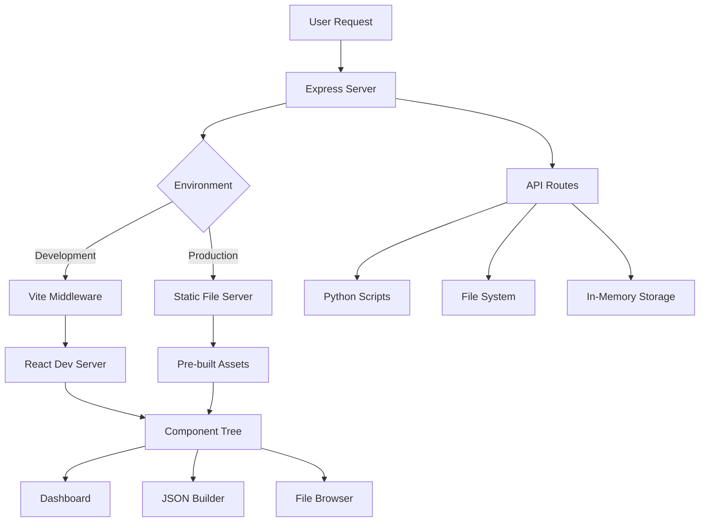
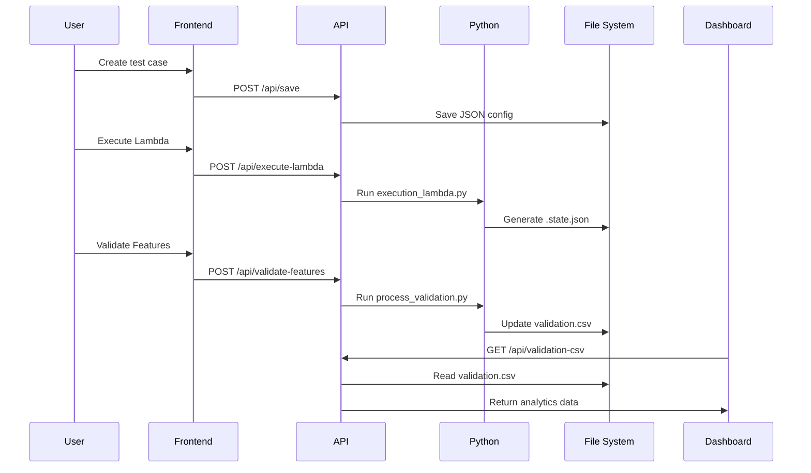

# Duke Energy Data Products Testing - Configuration Guide

## Table of Contents
1. [Environment Configuration](#environment-configuration)
2. [Port Management](#port-management)
3. [Development vs Production](#development-vs-production)
4. [Component Architecture](#component-architecture)
5. [Button Workflows](#button-workflows)
6. [Database Management](#database-management)
7. [File Operations](#file-operations)
8. [Python Script Integration](#python-script-integration)
9. [API Endpoints](#api-endpoints)
10. [Deployment Configuration](#deployment-configuration)
11. [Troubleshooting](#troubleshooting)
12. [Performance Tuning](#performance-tuning)

---

## Environment Configuration

### Environment Variables
The application supports the following environment variables:

```bash
# .env file (optional)
NODE_ENV=development|production
PORT=5000                    # Custom port (optional)
```

### Port Assignment Strategy
```typescript
// Automatic port assignment logic
const port = process.env.PORT ? 
  parseInt(process.env.PORT) : 
  (process.env.NODE_ENV === 'production' ? 3000 : 5000);
```

### Host Configuration
- **Development**: `0.0.0.0:5000` (external access enabled)
- **Production**: `0.0.0.0:3000` (or custom PORT)
- **Replit**: Automatically forwards to external ports 80/443

---

## Port Management

### Port Usage Matrix

| Mode | Internal Port | External Port (Replit) | Host | Features |
|------|---------------|------------------------|------|----------|
| Development | 5000 | 80/443 | 0.0.0.0 | HMR, Dev tools |
| Production | 3000 | 80/443 | 0.0.0.0 | Static serving |
| Custom | PORT env | 80/443 | 0.0.0.0 | User defined |

### Port Conflict Resolution

#### Common Scenarios
1. **Development server already running**
   ```bash
   Error: EADDRINUSE: address already in use 127.0.0.1:5000
   ```

2. **Multiple instances attempting same port**
   ```bash
   Error: listen EADDRINUSE: address already in use 0.0.0.0:3000
   ```

#### Solutions

##### Option 1: Stop Existing Processes
```bash
# Find processes using port 5000
lsof -i :5000                    # Unix/Linux/macOS
netstat -ano | findstr :5000     # Windows

# Kill specific process
kill -9 <PID>                    # Unix/Linux/macOS
taskkill /PID <PID> /F           # Windows

# Kill all node processes (nuclear option)
killall node                     # Unix/Linux/macOS
taskkill /IM node.exe /F         # Windows
```

##### Option 2: Use Different Port
```bash
# Set custom port via environment variable
PORT=3001 npm start

# Or create .env file
echo "PORT=3001" > .env
npm start
```

##### Option 3: Workflow Management
Use Replit workflows to manage server lifecycle:
- Stop "Development" workflow before starting "Production"
- Use designated workflows for different environments

### Replit-Specific Port Handling

#### Automatic Port Forwarding
Replit automatically forwards internal ports to external URLs:
- Internal port 5000 → External port 80 (default)
- Internal port 3000 → External port 3000
- Other ports: 3001, 3002, 3003, 4200, 6000, 8000, 8080, 8081

#### .replit Configuration
```toml
# Automatic port binding
[[ports]]
localPort = 5000
externalPort = 80
exposeLocalhost = false

[[ports]]
localPort = 3000
externalPort = 3000
exposeLocalhost = false
```

---

## Development vs Production

### Development Mode (`npm run dev`)

#### Features
- **Vite Development Server**: Hot module replacement (HMR)
- **TypeScript Compilation**: Real-time type checking
- **Auto-reload**: Browser refreshes on file changes
- **Source Maps**: Debugging with original source code
- **Development Middleware**: Enhanced error reporting

#### Configuration
```typescript
// Development-specific setup
if (app.get("env") === "development") {
  await setupVite(app, server);
  // Vite middleware handles:
  // - HMR WebSocket connections
  // - TypeScript compilation
  // - Asset serving with cache busting
}
```

#### File Serving
- React components served from `client/src/`
- Hot reloading for instant feedback
- Development-optimized bundles

### Production Mode (`npm run build && npm start`)

#### Build Process
```bash
# 1. Vite builds frontend
vite build
# Output: dist/public/ (static assets)

# 2. esbuild bundles server
esbuild server/index.ts --platform=node --packages=external --bundle --format=esm --outdir=dist
# Output: dist/index.js (server bundle)
```

#### Features
- **Static File Serving**: Pre-built assets from `dist/public/`
- **Optimized Bundles**: Minified and compressed
- **Production Headers**: Security and caching headers
- **Error Boundaries**: Graceful error handling

#### Configuration
```typescript
// Production-specific setup
if (app.get("env") === "production") {
  serveStatic(app);
  // Serves from dist/public/
  // Fallback to index.html for SPA routing
}
```

### Mode Comparison

| Aspect | Development | Production |
|--------|-------------|------------|
| **Startup Time** | ~3-5 seconds | ~1 second |
| **Bundle Size** | Large (with dev tools) | Optimized |
| **Source Maps** | Full source maps | Production maps |
| **Error Handling** | Detailed stack traces | User-friendly errors |
| **Caching** | Disabled | Aggressive caching |
| **Hot Reload** | Enabled | Disabled |

---

## Component Architecture

### Application Structure



### Component Communication

#### State Management Flow
```typescript
// Global state via TanStack Query
const queryClient = new QueryClient({
  defaultOptions: {
    queries: {
      staleTime: 30000,        // 30 seconds
      refetchInterval: 30000,  // Auto-refresh interval
      retry: 3,
      retryDelay: attemptIndex => Math.min(1000 * 2 ** attemptIndex, 30000)
    }
  }
});
```

#### Component Hierarchy
```
App
├── ThemeProvider
├── QueryClientProvider
├── Header (Navigation)
├── Dashboard
│   ├── StatsCards
│   ├── Charts (Recharts)
│   ├── FilterControls
│   └── ValidationTable
├── JSONBuilder
│   ├── FormBuilder
│   ├── JSONEditor (CodeMirror)
│   └── ActionSidebar
└── FileBrowser
    ├── DirectoryTree
    └── FilePreview
```

---

## Button Workflows

### Primary Action Buttons

#### 1. Generate JSON Button
```typescript
Location: JSON Builder → Form Section
Function: Convert form data to JSON configuration
Validation: Zod schema validation
Output: Formatted JSON in editor panel
```

**Implementation**:
```typescript
const handleGenerateJson = () => {
  try {
    const validatedData = JsonTestStructure.parse(formData);
    setJsonContent(JSON.stringify(validatedData, null, 2));
  } catch (error) {
    setErrors(error.errors);
  }
};
```

#### 2. Save Configuration Button
```typescript
Location: JSON Builder → Action Sidebar
API: POST /api/save
Process: Save JSON to test_config/ directory
Response: Success confirmation with file path
Process: Save JSON to test_configs/ directory
```

#### 3. Execute Lambda Button
```typescript
Location: JSON Builder → Action Sidebar
API: POST /api/execute-lambda
Process: 
  1. Save current configuration
  2. Execute Python script
  3. Generate state file
Response: Execution status and output
```

#### 4. Validate Features Button
```typescript
Location: JSON Builder → Action Sidebar
API: POST /api/validate-features
Process: Bulk validation with 1-minute timer
Script: src/common/utils/validation/process_validation.py
```

### Secondary Action Buttons

#### 5. Load Template Button
```typescript
Location: JSON Builder → Header
API: GET /api/load-template
Function: Load predefined JSON structure
Output: Populate form with template data
```

#### 6. State JSON Button
```typescript
Location: JSON Builder (conditional)
API: GET /api/state-json/:testCaseId/:action
Condition: Appears after lambda execution
Function: Display execution state in editor
```

#### 7. Refresh Button (Dashboard)
```typescript
Location: Dashboard → Header
Function: Manual data refresh
Effect: Invalidate TanStack Query cache
Auto-refresh: Temporarily disabled during manual refresh
```

---

## Database Management

### Storage Architecture

#### File-Based Persistence
```
test_config/                 # User configurations
├── CON0002719-55555.json   # Individual test cases
├── test5010.json
└── ...

test_execution_state/        # Generated results
├── create_validation/
│   ├── CON0002719-55555.state.json
│   └── test5010.state.json
├── update_validation/
└── delete_validation/

validation.csv              # Historical data for dashboard
```

#### In-Memory Processing
```typescript
// MemStorage class handles runtime data
class MemStorage {
  private users: Map<number, User>
  private testCases: Map<number, TestCase>
  private databases: Map<number, Database>
  private validationResults: Map<number, ValidationResult>
}
```

### Data Flow Diagram



### Database Connection Management

#### Default Databases
```typescript
// Pre-configured database connections
const defaultDatabases = [
  {
    connectionName: "Test_&_Raw/GSDS",
    host: "localhost",
    port: 5432,
    databaseName: "gsds_test",
    username: "admin",
    password: "password",
    databaseType: "postgres"
  },
  {
    connectionName: "Production/GSDS",
    host: "prod-server",
    port: 5432,
    databaseName: "gsds_prod",
    username: "admin",
    password: "password",
    databaseType: "postgres"
  }
];
```

#### Environment Variable Generation
When new databases are added, the system automatically generates `.env` entries:
```bash
# Auto-generated entries
TEST_RAW_GSDS_HOST="localhost"
TEST_RAW_GSDS_PORT=5432
TEST_RAW_GSDS_DATABASE_NAME="gsds_test"
# ... etc
```

---

## File Operations

### Supported File Types

#### JSON Configuration Files
```typescript
// Schema validation for .json files
interface TestConfiguration {
  tests: Array<{
    test_case_id: string;
    test_case_description: string;
    action: "CREATE" | "UPDATE" | "DELETE";
    inputs: Array<{
      feature_sr_no: number;
      domain: "land" | "gas" | "electric" | "";
      feature: string;
      validation: Array<{
        database: string;
        sql_query: string;
        expected_result: Record<string, string>;
      }>;
    }>;
  }>;
}
```

#### State Files
```typescript
// Generated by Python scripts
interface StateFile {
  test_case_id: string;
  execution_timestamp: string;
  status: "success" | "failed" | "pending";
  results: Array<{
    step: string;
    status: string;
    details: any;
  }>;
}
```

#### CSV Data Structure
```csv
test_case_id,domain,stage,test_case_validation_status,executed_at,error_message
CON0002719-38889,gas,create,passed,2025-01-15T10:30:00Z,""
CON0002720-38890,land,update,failed,2025-01-15T11:15:00Z,"Database connection timeout"
```

### File Security

#### Path Validation
```typescript
// Prevent directory traversal attacks
const isValidPath = (filePath: string) => {
  const fullPath = path.join(process.cwd(), filePath);
  return fullPath.startsWith(process.cwd());
};
```

#### Access Control
- Read-only access to execution state files
- Write access limited to test_configs/ directory
- File type validation for uploads

---

## Python Script Integration

### Script Architecture

#### execution_lambda.py
```python
# Individual test case execution
def execute_test_case(config_file):
    """
    Execute a single test case configuration
    Generate state JSON file with results
    """
    pass
```

#### process_validation.py
```python
# Bulk validation processing
def process_all_validations():
    """
    Process all test configurations
    Generate comprehensive validation report
    Update validation.csv with results
    """
    pass
```

### Node.js → Python Communication

#### Script Execution Pattern
```typescript
async function executeScript(scriptPath: string, args: string[] = []): Promise<string> {
  return new Promise((resolve, reject) => {
    const python = spawn('python3', [scriptPath, ...args]);
    
    let output = '';
    let errorOutput = '';
    
    python.stdout.on('data', (data) => {
      output += data.toString();
    });
    
    python.stderr.on('data', (data) => {
      errorOutput += data.toString();
    });
    
    python.on('close', (code) => {
      if (code === 0) {
        resolve(output);
      } else {
        reject(new Error(errorOutput || `Process exited with code ${code}`));
      }
    });
    
    // Timeout after 5 minutes
    setTimeout(() => {
      python.kill();
      reject(new Error('Script execution timeout'));
    }, 5 * 60 * 1000);
  });
}
```

#### Error Handling Strategy
```typescript
// Comprehensive error handling
try {
  const result = await executeScript(scriptPath);
  res.json({ success: true, output: result });
} catch (error) {
  console.error('Script execution failed:', error);
  res.status(500).json({ 
    success: false, 
    message: 'Script execution failed',
    error: error.message 
  });
}
```

---

## API Endpoints

### Complete API Reference

#### Configuration Management
```typescript
// Save test configuration
POST /api/save
Body: JsonTestStructure
Response: { success: boolean, filename: string, path: string }

// Load template
GET /api/load-template
Response: JsonTestStructure (default template)

// Upload and validate JSON
POST /api/upload-json
Body: { jsonData: any }
Response: { success: boolean, data?: JsonTestStructure }
```

#### Execution Control
```typescript
// Execute individual test
POST /api/execute-lambda
Response: { success: boolean, message: string, output?: string }

// Bulk validation
POST /api/validate-features
Response: { success: boolean, message: string }

// Get execution state
GET /api/state-json/:testCaseId/:action
Response: { success: boolean, data: any, filename: string }
```

#### Data Retrieval
```typescript
// Validation results for dashboard
GET /api/validation-csv
Response: ValidationRecord[]

// Dashboard statistics
GET /api/dashboard-stats
Response: {
  totalTests: number,
  passedTests: number,
  failedTests: number,
  successRate: number,
  byStage: { create: number, update: number, delete: number }
}
```

#### File Operations
```typescript
// Browse execution files
GET /api/execution-files
Response: { success: boolean, files: FileNode[] }

// Get file content
GET /api/execution-files/content?path={string}
Response: { success: boolean, content: string }
```

#### Database Management
```typescript
// Test database connection
POST /api/databases/test-connection
Body: DatabaseCredentials
Response: { success: boolean, message: string }

// Get all databases
GET /api/databases
Response: Database[]

// Create database connection
POST /api/databases
Body: DatabaseConfig
Response: Database
```

---

## Deployment Configuration

### Replit Deployment Strategy

#### Workflow Configuration
```yaml
# Development Workflow
commands:
  - npm install
  - npm run dev
environment: development
port: 5000

# Production Workflow  
commands:
  - npm install
  - npm run build
  - npm start
environment: production
port: 3000
```

#### Environment Variables for Deployment
```bash
# Required for production
NODE_ENV=production
PORT=3000

# Optional database configurations
DATABASE_URL=postgresql://...
REDIS_URL=redis://...
```

### Manual Deployment Steps

#### 1. Pre-deployment Checklist
```bash
# Verify Node.js version
node --version  # Should be 18+

# Check Python availability
python3 --version  # Should be 3.8+

# Verify dependencies
npm audit
npm run build  # Test build process
```

#### 2. Production Build Process
```bash
# Clean previous builds
rm -rf dist/

# Install dependencies
npm ci  # Use exact package-lock.json versions

# Build frontend
npm run build
# Generates: dist/public/ (static assets)
#           dist/index.js (server bundle)

# Start production server
npm start
```

#### 3. Health Check Verification
```bash
# Verify server is running
curl http://0.0.0.0:3000/api/validation-csv

# Check file operations
curl http://0.0.0.0:3000/api/execution-files

# Test Python integration
curl -X POST http://0.0.0.0:3000/api/execute-lambda
```

### Production Monitoring

#### Log Analysis
```typescript
// Structured logging for production
export function log(message: string, source = "express") {
  const timestamp = new Date().toISOString();
  const logLevel = process.env.NODE_ENV === 'production' ? 'INFO' : 'DEBUG';
  console.log(`[${timestamp}] [${logLevel}] [${source}] ${message}`);
}
```

#### Performance Metrics
```typescript
// Request timing middleware
app.use((req, res, next) => {
  const start = Date.now();
  res.on('finish', () => {
    const duration = Date.now() - start;
    if (duration > 1000) {  // Log slow requests
      log(`SLOW REQUEST: ${req.method} ${req.path} took ${duration}ms`);
    }
  });
  next();
});
```

---

## Troubleshooting

### Common Issues and Solutions

#### 1. Port Conflicts

**Issue**: `EADDRINUSE: address already in use`

**Diagnosis**:
```bash
# Check what's using the port
lsof -i :5000                    # Unix/Linux/macOS
netstat -ano | findstr :5000     # Windows

# Check Node.js processes
ps aux | grep node               # Unix/Linux/macOS
tasklist | findstr node.exe      # Windows
```

**Solutions**:
```bash
# Option 1: Kill specific process
kill -9 <PID>                    # Unix/Linux/macOS
taskkill /PID <PID> /F           # Windows

# Option 2: Kill all Node processes
killall node                     # Unix/Linux/macOS
taskkill /IM node.exe /F         # Windows

# Option 3: Use different port
PORT=3001 npm start

# Option 4: Wait and retry (port might be in TIME_WAIT)
sleep 30 && npm start
```

#### 2. Build Failures

**Issue**: TypeScript compilation errors during build

**Diagnosis**:
```bash
# Check TypeScript errors
npx tsc --noEmit

# Verify dependencies
npm ls --depth=0
```

**Solutions**:
```bash
# Fix TypeScript errors
npm run build 2>&1 | grep error

# Reinstall dependencies
rm -rf node_modules package-lock.json
npm install

# Clear TypeScript cache
rm -rf .tsbuildinfo
```

#### 3. Python Script Failures

**Issue**: Python scripts not executing

**Diagnosis**:
```bash
# Check Python availability
python3 --version
which python3

# Test script manually
python3 src/common/utils/execution_lambda.py

# Check file permissions
ls -la src/common/utils/*.py
```

**Solutions**:
```bash
# Fix Python path
export PATH="/usr/bin/python3:$PATH"

# Make scripts executable
chmod +x src/common/utils/*.py

# Install required packages
pip3 install -r requirements.txt  # if exists
```

#### 4. File Access Issues

**Issue**: Cannot read/write configuration files

**Diagnosis**:
```bash
# Check directory permissions
ls -la test_config/
ls -la test_execution_state/

# Verify disk space
df -h .
```

**Solutions**:
```bash
# Create missing directories
mkdir -p test_config test_execution_state

# Fix permissions
chmod 755 test_config/
chmod 755 test_execution_state/

# Check available space
du -sh .
```

#### 5. Frontend Loading Issues

**Issue**: Blank page or JavaScript errors

**Diagnosis**:
```bash
# Check browser console for errors
# Check network tab for failed requests
# Verify build output
ls -la dist/public/
```

**Solutions**:
```bash
# Rebuild frontend
rm -rf dist/
npm run build

# Check for missing assets
cat dist/public/index.html

# Clear browser cache
# Hard refresh: Ctrl+Shift+R (or Cmd+Shift+R)
```

### Performance Issues

#### 1. Slow API Responses

**Diagnosis**:
```typescript
// Add request timing
app.use((req, res, next) => {
  const start = Date.now();
  res.on('finish', () => {
    const duration = Date.now() - start;
    console.log(`${req.method} ${req.path}: ${duration}ms`);
  });
  next();
});
```

**Solutions**:
- Enable gzip compression
- Add response caching
- Optimize database queries
- Use streaming for large files

#### 2. Memory Leaks

**Diagnosis**:
```bash
# Monitor memory usage
node --inspect dist/index.js
# Open chrome://inspect in browser
```

**Solutions**:
- Clear TanStack Query cache periodically
- Remove event listeners properly
- Optimize Python script execution

#### 3. High CPU Usage

**Common Causes**:
- Multiple Python script executions
- Inefficient file watching
- Too frequent auto-refresh

**Solutions**:
```typescript
// Throttle auto-refresh
const throttledRefresh = useMemo(
  () => throttle(fetchData, 30000),  // Max once per 30 seconds
  [fetchData]
);
```

---

## Performance Tuning

### Frontend Optimizations

#### 1. React Query Configuration
```typescript
const queryClient = new QueryClient({
  defaultOptions: {
    queries: {
      staleTime: 5 * 60 * 1000,     // 5 minutes
      cacheTime: 10 * 60 * 1000,    // 10 minutes
      refetchOnWindowFocus: false,   // Disable refocus refetch
      retry: 2,                      // Reduce retry attempts
    }
  }
});
```

#### 2. Component Memoization
```typescript
// Expensive calculations
const chartData = useMemo(() => {
  return processValidationData(rawData);
}, [rawData]);

// Event handlers
const handleFormChange = useCallback((field: string, value: any) => {
  setFormData(prev => ({ ...prev, [field]: value }));
}, []);

// Component memoization
const ExpensiveComponent = memo(({ data }: { data: any[] }) => {
  // Component implementation
});
```

#### 3. Bundle Optimization
```typescript
// vite.config.ts optimizations
export default defineConfig({
  build: {
    rollupOptions: {
      output: {
        manualChunks: {
          vendor: ['react', 'react-dom'],
          ui: ['@radix-ui/react-button', '@radix-ui/react-dialog'],
          charts: ['recharts'],
        }
      }
    },
    chunkSizeWarningLimit: 600,
  }
});
```

### Backend Optimizations

#### 1. File System Caching
```typescript
// Cache directory structure
const directoryCache = new Map<string, any>();
const CACHE_TTL = 30000; // 30 seconds

const getCachedDirectory = (path: string) => {
  const cached = directoryCache.get(path);
  if (cached && Date.now() - cached.timestamp < CACHE_TTL) {
    return cached.data;
  }
  return null;
};
```

#### 2. Response Compression
```typescript
import compression from 'compression';

app.use(compression({
  level: 6,
  threshold: 1024,
  filter: (req, res) => {
    return compression.filter(req, res);
  }
}));
```

#### 3. Request Rate Limiting
```typescript
import rateLimit from 'express-rate-limit';

const limiter = rateLimit({
  windowMs: 15 * 60 * 1000, // 15 minutes
  max: 100, // Limit each IP to 100 requests per windowMs
  message: 'Too many requests from this IP'
});

app.use('/api/', limiter);
```

### Database Optimizations

#### 1. Query Optimization
```typescript
// Paginate large datasets
const getValidationResults = async (page = 1, limit = 50) => {
  const offset = (page - 1) * limit;
  return results.slice(offset, offset + limit);
};
```

#### 2. Index Strategy
```sql
-- If using actual database
CREATE INDEX idx_test_case_id ON validation_results(test_case_id);
CREATE INDEX idx_executed_at ON validation_results(executed_at);
CREATE INDEX idx_status ON validation_results(status);
```

---

This comprehensive configuration guide provides detailed information for setting up, deploying, and troubleshooting the Duke Energy Data Products Testing application. The port configuration has been fixed to prevent conflicts between development and production modes, and extensive documentation covers all operational aspects.
